# 全球加速客户端VPN搭建
## 基于Openswan on Amazon Linux 2，AWS Global Accelerator

该向导实现海外用户通过VPN客户端访问国内数据中心的服务器资源，通过AWS Global Accelerator利用AWS全球骨干网进行链路加速，这篇向导主要包含在AWS香港区域在EC2上安装Openswan的VPN服务器，AWS Global Accelerator的配置以及在Windows上VPN客户端的配置。不包含transit gateway和direct connect的配置，以及数据中心路由器的配置。
### 架构图

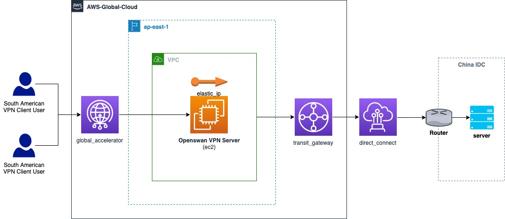

### 在EC2上自动化部署Openswan
在AWS管理控制台上创建操作系统为Amazon Linux 2的实例，申请弹性IP（EIP）关联到这台实例上（该过程略），然后ssh登陆后执行
```
sudo su
yum update -y
yum install git -y
git clone https://github.com/comdaze/Openswan-client-vpn-by-AWS-Global-Accelerator.git
cd Openswan-client-vpn-by-AWS-Global-Accelerator
sh install-openswan.sh

  % Total    % Received % Xferd  Average Speed   Time    Time     Time  Current
                                 Dload  Upload   Total   Spent    Left  Speed
100    12  100    12    0     0   7250      0 --:--:-- --:--:-- --:--:-- 12000
  % Total    % Received % Xferd  Average Speed   Time    Time     Time  Current
                                 Dload  Upload   Total   Spent    Left  Speed
100    13  100    13    0     0   6007      0 --:--:-- --:--:-- --:--:--  6500
  % Total    % Received % Xferd  Average Speed   Time    Time     Time  Current
                                 Dload  Upload   Total   Spent    Left  Speed
100    12  100    12    0     0  13714      0 --:--:-- --:--:-- --:--:-- 12000
172.31.35.46 is the server IP?
172.31.35.46 is the server local IP?
18.166.147.52 is the server local IP?
If 172.31.35.46 is correct, press enter directly.
If 172.31.35.46 is incorrect, please input your server IP.
(Default server IP: 172.31.35.46):

======================================
Network Interface list:
eth0
lo
ppp0
======================================
Which network interface you want to listen for ocserv?
Default network interface is eth0, let it blank to use default network interface:

Please input IP-Range:
(Default IP-Range: 10.0.0):

Please input PSK:
(Default PSK: ueibo.cn): sean.com

Please input VPN username:
(Default VPN username: ueibo.com): sean
Please input sean's password:
Default password is NBuOLTJXyE, let it blank to use default password: NBuOLTJXyE

Server Local IP:
172.31.35.46

Client Remote IP Range:
10.0.0.10-10.0.0.254

PSK:
sean.com

Press any key to start...

```
接下来屏幕会输出安装过程，确认所有服务启动正常，最后会显示如下信息：
```
If there are no [FAILED] above, then you can
connect to your L2TP VPN Server with the default
user/password below:

ServerIP: 172.31.35.46
username: sean
password: NBuOLTJXyE
PSK: sean.com
```

手动安装参考：[在EC2上手动部署Openswan](./Manual-installation.md)

### 修改EC2联网设置
默认情况下，源/目的地检查是由你的EC2实例执行的。Openswan的EC2作为VPN Server是一个NAT实例，要处理来源或目的地不是它自己，所以要停止源/目的地检查。
选中该实例, 点击**Actions**，选择**Netwoking**,选择**Change source/destination check**。
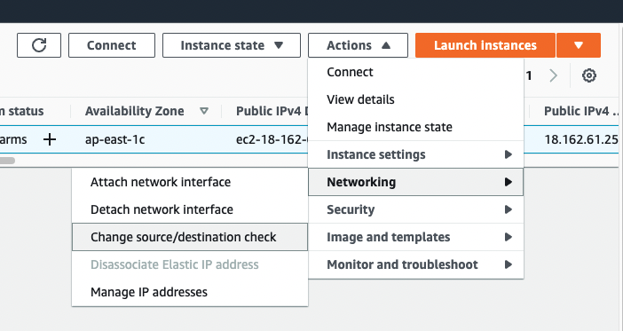

进入**Source/destination check**设置页面，勾选**Stop**，然后**Save**。
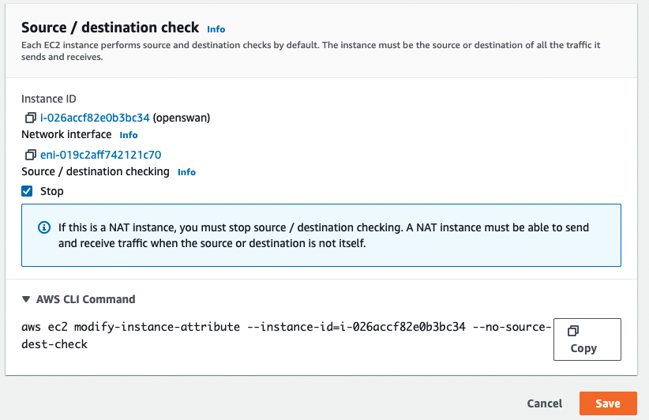

### AWS Global Accelerator配置
进入AWS Global Accelerator服务配置界面，创建新的Accelerator

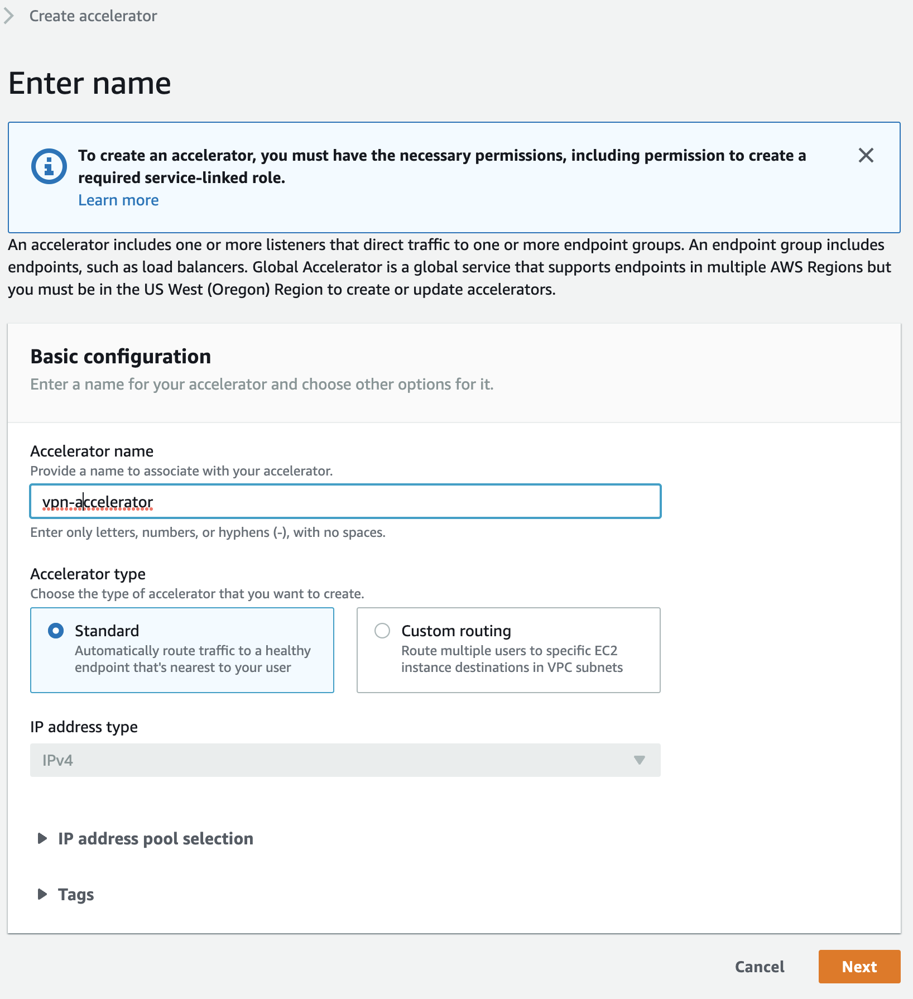

添加listener

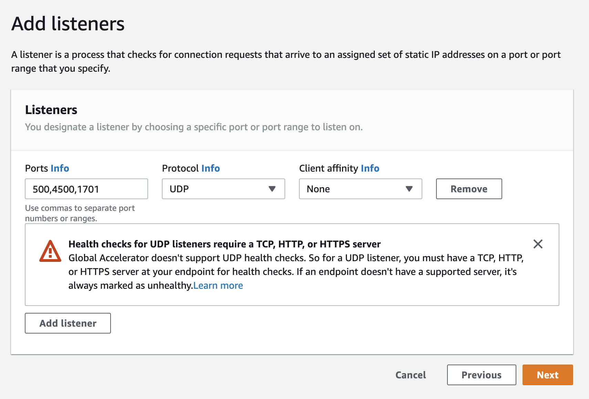

添加endpint group

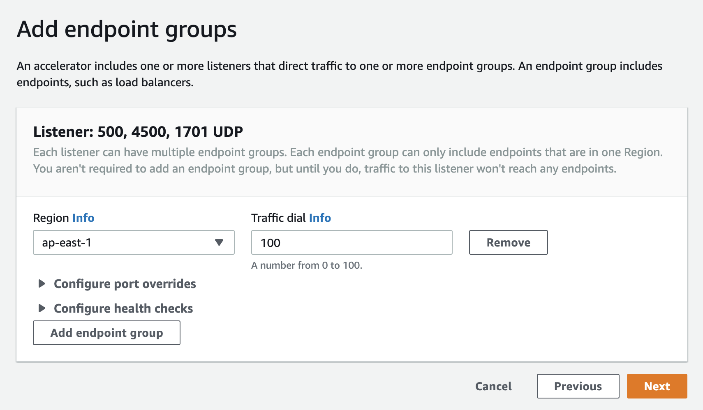

添加endpoint,点击Create accelerator
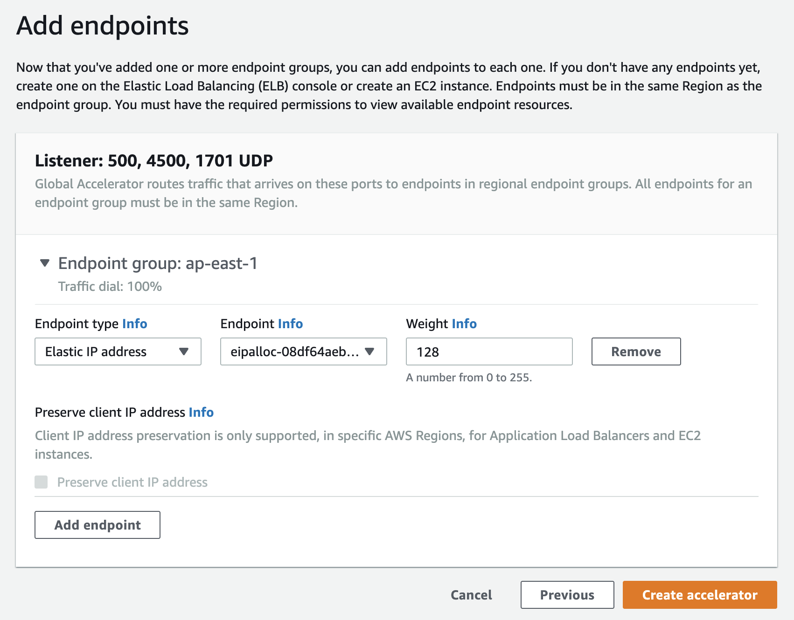

等待创建完成后，可以查看配置，可以看到分配了两个静态公网IP，和一个DNS Name

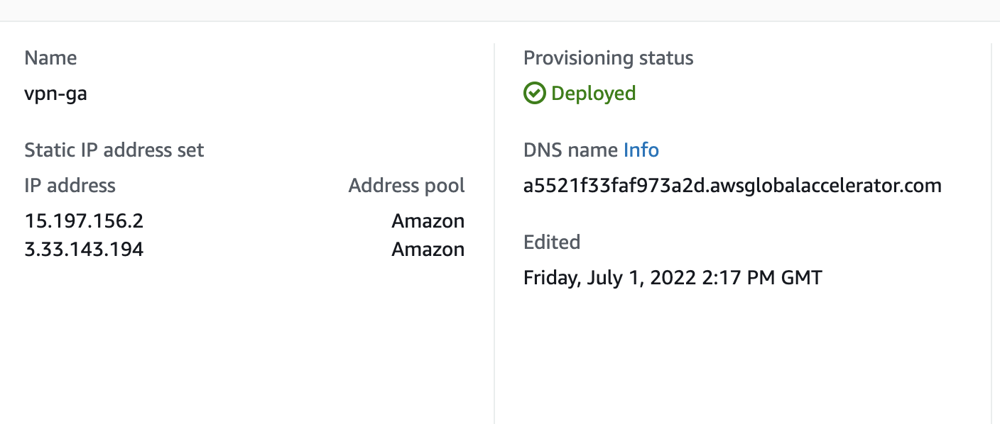

复制这个DNS Name，下一步在Windows客户端配置VPN Client，在Windows Setting查找VPN

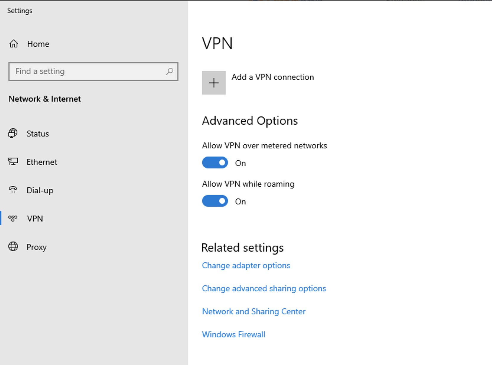

增加一个VPN连接，如下信息，服务器名称输入上一步创建的Accelerator的DNS Name，VPN类型选择L2TP/IPsec with certificate，用户名密码为Openswan安装过程中输入的用户名密码

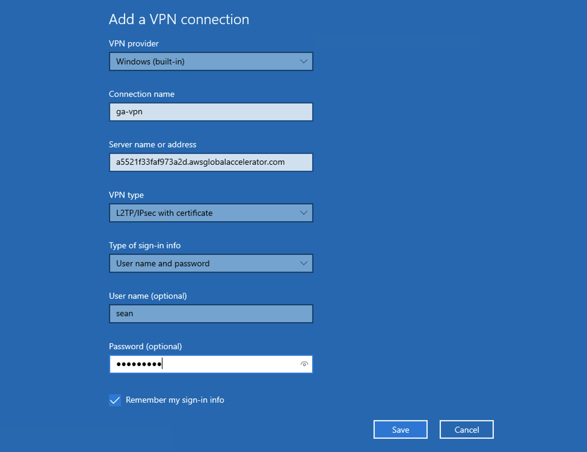

创建完成后，点击连接，成功连接后查看获得IP地址：

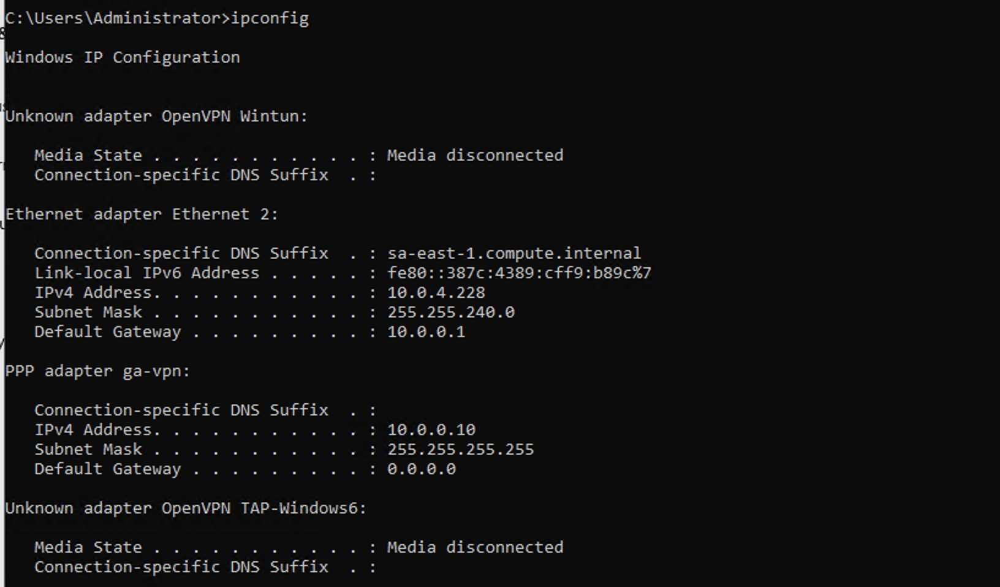

为了让VPN客户端可以访问VPC内部的其他服务器，在这些服务器实例所在的子网的路由表增加一条记录：

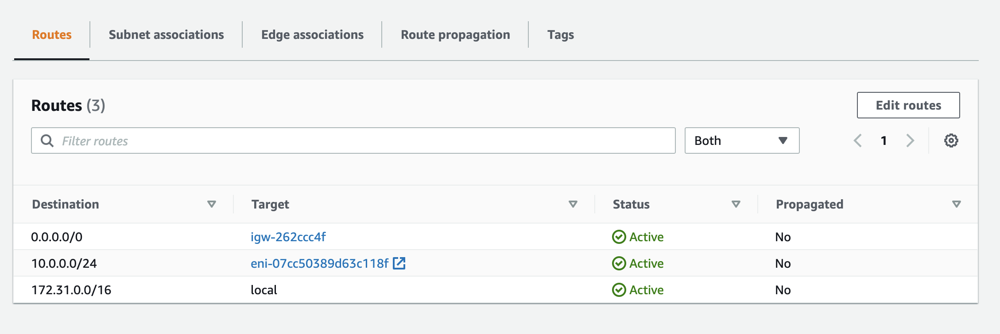

最后在VPN客户端上ping一台VPC中的服务器实例：
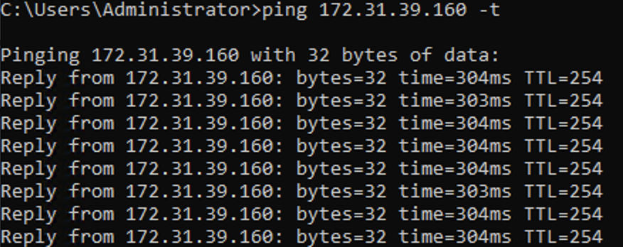

可以看到延迟为304ms，如果VPN客户端直接连接VPN服务器的公网IP，延迟为350ms。

### 结论
通过AWS Global Accelerator确实可以实现VPN客户端的加速访问！